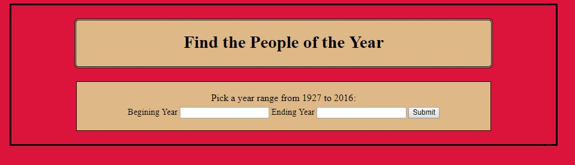
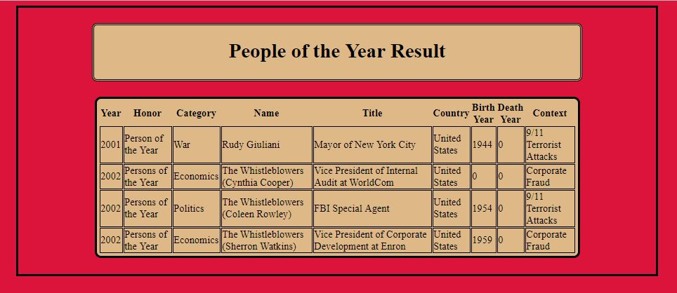

# Lab11-FirstMVC

We were tasked to create a full stack MVC using ASP.net Core, where we read a CSV file in the wwwroot folder using System IO. 
That information from the file is then assigns that to the object
Then this program will query the list and returns data based on input from the user and displayed the results of People of the Year

## TimePerson Object properties
	- Year
    - Honor
    - Name
    - Country
    - BirthYear (will populate with 0 if it is blank in the file)
    - DeathYear (will populate with 0 if it is blank in the file)
    - Title
    - Category
    - Context

## Solution

This is what the user will see when they arrive, and are to enter begining year range, and ending year range.
This information will be passed into the GetPersons method where it will use LINQ to query the data to just those years

This is what the results page would look like

## Contributors

Gwen provided help with path

## Contributing

If you'd like to contribute, please fork the repository and use a feature
branch. Pull requests are warmly welcome.

## Licensing

The code in this project is licensed under MIT license.
